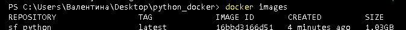
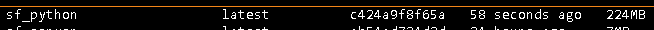

# Python Docker Project

## Описание

Этот проект представляет собой Docker-контейнер с Python, предназначенный для упрощения развертывания и изоляции Python-приложений. 

## Использование

### Удаление предыдущего образа

Перед сборкой нового образа убедитесь, что предыдущий образ удален. Остановите все контейнеры, использующие старый образ, если такие есть, и удалите его:

`docker rmi -f sf_python:latest`
### Сборка нового образа

Для сборки нового образа используйте следующую команду:

`docker build -t sf_python .`
### Запуск нового контейнера

После успешной сборки нового образа, запустите контейнер:

`docker run --name sf_python_container -d sf_python`
### Проверка списка образов

Чтобы убедиться, что образ собран и запущен корректно, вы можете проверить список образов:

`docker images`
## Разница в объеме

Для наглядности приведены два изображения, показывающие разницу в размере Docker-образов до и после оптимизации:

### Первоначальный образ

### Оптимизированный образ

Как видно, оптимизированный образ значительно меньше по размеру, что позволяет экономить ресурсы и ускоряет развертывание.
